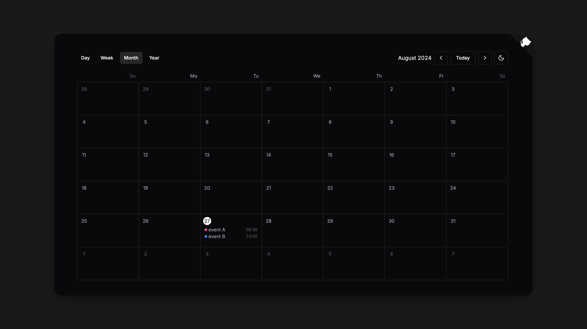

# Full Calendar for shadcn/ui

- Keyboard shortcuts
- View modes: day, week, month, year
- shadcn/ui base
- non Package



## Getting Started

Install the dependencies:

```bash
pnpm add date-fns react-hotkeys-hook
```

Copy the [components/ui/full-calendar.tsx](components/ui/full-calendar.tsx) to your project.

## Usage

```tsx
<Calendar
  events={[
    {
      id: '1',
      start: new Date('2024-08-26T09:30:00Z'),
      end: new Date('2024-08-26T14:30:00Z'),
      title: 'event A',
      color: 'pink',
    },
    {
      id: '2',
      start: new Date('2024-08-26T10:00:00Z'),
      end: new Date('2024-08-26T10:30:00Z'),
      title: 'event B',
      color: 'blue',
    },
  ]}
>
  <div className="h-dvh py-6 flex flex-col">
    <div className="flex px-6 items-center gap-2 mb-6">
      <CalendarViewTrigger className="aria-[current=true]:bg-accent" view="day">
        Day
      </CalendarViewTrigger>
      <CalendarViewTrigger
        view="week"
        className="aria-[current=true]:bg-accent"
      >
        Week
      </CalendarViewTrigger>
      <CalendarViewTrigger
        view="month"
        className="aria-[current=true]:bg-accent"
      >
        Month
      </CalendarViewTrigger>
      <CalendarViewTrigger
        view="year"
        className="aria-[current=true]:bg-accent"
      >
        Year
      </CalendarViewTrigger>

      <span className="flex-1" />

      <CalendarCurrentDate />

      <CalendarPrevTrigger>
        <ChevronLeft size={20} />
        <span className="sr-only">Previous</span>
      </CalendarPrevTrigger>

      <CalendarTodayTrigger>Today</CalendarTodayTrigger>

      <CalendarNextTrigger>
        <ChevronRight size={20} />
        <span className="sr-only">Next</span>
      </CalendarNextTrigger>

      <ModeToggle />
    </div>

    <div className="flex-1 overflow-auto px-6 relative">
      <CalendarDayView />
      <CalendarWeekView />
      <CalendarMonthView />
      <CalendarYearView />
    </div>
  </div>
</Calendar>
```
